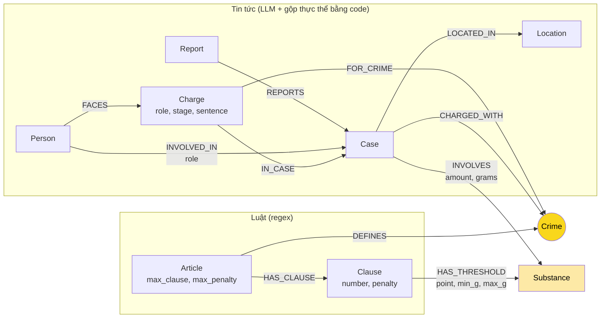

# Thiết kế Ontology — Day 19

**Họ tên:** Trần Nguyễn Thái Duy  **MSSV:** 2A202602991

**Lựa chọn** (đánh dấu một):
- [ ] Dùng ontology gợi ý (có thể chỉnh nhỏ)
- [x] Tự thiết kế (xét bonus +15, xem `SUBMISSION.md`)

> Code: các phần đánh dấu `OWN` trong `src/graph.py`. Ontology gợi ý vẫn được giữ lại (phần `HINT`) làm baseline, chạy bằng `KG_ONTOLOGY=hint python bench_kg.py --judge --out ket_qua_benchmark_kg.hint.txt`. Mặc định (không đặt biến môi trường) là ontology của tôi.

## 1. Sơ đồ

**Node cầu nối chính: `Crime`** (vàng đậm). `Substance` (vàng nhạt) là cầu nối thứ hai, dùng để đối chiếu khối lượng trong vụ án với ngưỡng khối lượng trong khoản luật.

## 2. Entity types (node labels)

Số lượng lấy từ graph của lần chạy sinh ra `ket_qua_benchmark_kg.txt` (242 node / 523 cạnh).

| Label | Số node | Ý nghĩa | Khóa định danh (`MERGE` theo) | Properties | Lấy từ KB nào | Trích bằng |
| --- | --- | --- | --- | --- | --- | --- |
| `Article` | 18 | Một Điều luật | `id` ("Điều 251 BLHS") | `title`, `law`, `doc_id`, `max_clause`, `max_penalty` | Luật | regex |
| `Clause` | 99 | Một khoản của Điều | `id` ("Điều 251 BLHS khoản 1") | `number`, `penalty`, `text`, `supplementary`, `doc_id` | Luật | regex |
| `Crime` | 13 | Tội danh (cầu nối) | `name` (đã chuẩn hóa: bỏ "Tội", chữ thường) | — | Luật (tiêu đề Điều) | regex + `normalize_crime` |
| `Substance` | 16 | Chất ma túy (cầu nối thứ hai) | `name` (tên chuẩn) | `aliases` | Cả hai | bảng tên chuẩn `SUBSTANCE_ALIASES` + `link_substance` |
| `Report` | 20 | Một bài báo (nguồn tin) | `doc_id` | `name` (tiêu đề), `published` | Tin | metadata của file, không cần LLM |
| `Case` | 10 | Một vụ việc ngoài đời (có thể do nhiều bài đưa tin) | `id` (sinh từ `doc_id` của bài sớm nhất, vd `case-100260917203001265-1`) | `name`, `summary`, `date`, `doc_id` (chỉ khi vụ có đúng 1 bài) | Tin | LLM, rồi gộp bằng `resolve_cases` |
| `Person` | 32 | Một cá nhân có họ tên | `key` (họ tên chữ thường, đã quy biệt danh về tên thật) | `name`, `aliases` | Tin | LLM + lọc/gộp bằng code |
| `Charge` | 27 | Một lần buộc tội: (người, tội danh, vụ việc) | `id` = `người\|tội\|vụ` | `name`, `role`, `stage`, `sentence`, `doc_id` (bài mới nhất) | Tin | LLM + `link_crime` |
| `Location` | 7 | Tỉnh/thành | `name` | — | Tin | LLM |

Về hợp đồng `doc_id`: `Article`, `Clause`, `Report`, `Charge` luôn có `doc_id`; `Case` chỉ có khi vụ đến từ đúng một bài. `Crime`, `Substance`, `Person`, `Location` và `Case` gộp từ nhiều bài là node dùng chung nên không có `doc_id`.

## 3. Relationships

| Type | Số cạnh | Từ → Đến | Properties trên cạnh | Ý nghĩa |
| --- | --- | --- | --- | --- |
| `DEFINES` | 13 | `Article` → `Crime` | — | Điều luật định nghĩa tội danh |
| `HAS_CLAUSE` | 99 | `Article` → `Clause` | — | Điều có các khoản |
| `HAS_THRESHOLD` | 243 | `Clause` → `Substance` | `point` (điểm a, b…), `min_g`, `max_g` (gam; `null` = "trở lên"), `text` (nguyên văn ngưỡng) | Khoản này áp dụng khi chất đó có khối lượng trong khoảng [min_g, max_g) |
| `REPORTS` | 17 | `Report` → `Case` | — | Bài báo đưa tin về vụ việc |
| `CHARGED_WITH` | 12 | `Case` → `Crime` | — | Các tội danh xuất hiện trong vụ (mức vụ việc) |
| `INVOLVES` | 15 | `Case` → `Substance` | `amount` (nguyên văn: "hơn 9,6kg"), `grams` (9600.0, `null` nếu không phải khối lượng) | Chất và khối lượng trong vụ |
| `LOCATED_IN` | 11 | `Case` → `Location` | — | Nơi xảy ra |
| `INVOLVED_IN` | 32 | `Person` → `Case` | `role` | Người có mặt trong vụ (kể cả người không bị buộc tội) |
| `FACES` | 27 | `Person` → `Charge` | — | Người bị buộc tội |
| `FOR_CRIME` | 27 | `Charge` → `Crime` | — | Lần buộc tội này về tội gì (**cạnh bắc cầu sang luật**) |
| `IN_CASE` | 27 | `Charge` → `Case` | — | Lần buộc tội này thuộc vụ nào |

## 4. Node cầu nối giữa 2 KB

- **Node nào:** `Crime` (chính) và `Substance` (phụ).
- **Vì sao chọn node này:** tội danh là thứ duy nhất được cả hai KB gọi bằng cùng một cụm từ pháp lý: luật *định nghĩa* nó ở tiêu đề Điều, báo *dùng* nó khi nói ai bị khởi tố/truy tố/xét xử. Tên người, tên vụ chỉ có ở tin; số Điều hầu như không xuất hiện trong tin. `Substance` được thêm làm cầu thứ hai vì câu hỏi dạng "với khối lượng này thì áp dụng khoản nào" (Q5) cần đi từ *vụ* sang *khoản* qua *chất*, không qua tội danh.
- **Cách đảm bảo hai phía khớp tên:**
  1. Phía luật: tên tội lấy bằng regex từ tiêu đề Điều rồi `normalize_crime`, nên luôn ổn định.
  2. Phía tin: danh sách 13 tội danh chuẩn được đưa vào prompt, yêu cầu LLM chọn nguyên văn.
  3. LLM không luôn tuân thủ, nên mọi tội danh trả về vẫn qua `link_crime` = `link_entity` hai lần: lần 1 so khớp chặt (`normalize_crime`, fuzzy 0,8 để bắt `tuý`/`túy`); lần 2 dùng khóa lỏng hơn `crime_key` (bỏ "trái phép", "chất") để bắt cách viết tắt của báo như "mua bán ma túy", "tổ chức sử dụng ma túy".
  4. `Substance`: bảng tên chuẩn + biệt danh (`thuốc lắc` → MDMA, `ma túy đá` → Methamphetamine, `ketamin` → Ketamine…), node chuẩn được tạo trước khi nạp bất kỳ tài liệu nào.
- **Khi nào cầu gãy, và tôi xử lý thế nào:**
  - *Tội danh không khớp tên chuẩn* → `link_crime` trả `None`, không tạo `Charge` (không nối bừa). Người đó vẫn có cạnh `INVOLVED_IN` nên không mất khỏi graph.
  - *Bài báo đầu tiên chưa nêu tội danh* (mới bắt giữ) → trong ontology gợi ý vụ đó thành node cô lập. Ở đây `resolve_cases` gộp các bài cùng nói về một người vào một `Case`, nên tội danh từ bài sau tự nối cho cả vụ (ví dụ "Vụ bắt giữ Nguyễn Minh Đức tại Ninh Bình": gợi ý không có `CHARGED_WITH`, bản này có).
  - *Vụ không có người nêu tên* (840kg ở Preah Sihanouk) → không có `Charge`; `context()` lùi về cạnh mức vụ `Case-[:CHARGED_WITH]->Crime`.
  - *Tội danh nằm ngoài KB luật* (vụ "chống người thi hành công vụ" ở An Giang) → gãy là đúng, chấp nhận.

## 5. Competency questions

| Câu | Đường đi (Cypher pattern) | Trả lời được? |
| --- | --- | --- |
| Q1 | Không cần graph: định nghĩa "tiền chất" nằm trong một khoản của Điều 2 Luật PCMT, vector search lấy được. Graph chỉ góp `(:Article {doc_id})-[:HAS_CLAUSE]->(:Clause)` làm seed. | Được (nhờ chunk, không nhờ graph) |
| Q2 | `(:Report {doc_id ∈ top-k})-[:REPORTS]->(k:Case)<-[:IN_CASE]-(ch:Charge {sentence:'tử hình'})<-[:FACES]-(p:Person)` | Được |
| Q3 | `(:Person {name:'Lê Minh Thành'})-[:FACES]->(ch:Charge {sentence})-[:FOR_CRIME]->(:Crime)<-[:DEFINES]-(a:Article)-[:HAS_CLAUSE]->(:Clause {number:1, penalty})` | Được |
| Q4 | `(:Person)` có `'Hoàng Nato' IN aliases` `-[:FACES]->(:Charge)-[:FOR_CRIME]->(:Crime)<-[:DEFINES]-(a:Article)` rồi đọc `a.max_clause`, `a.max_penalty` | Được (ontology gợi ý **không** trả lời được phần "tối đa") |
| Q5 | `(:Person {name:'Cái Quang Huy'})-[:FACES]->(ch)-[:FOR_CRIME]->(:Crime)<-[:DEFINES]-(a:Article)`, và `(ch)-[:IN_CASE]->(k)-[i:INVOLVES]->(s:Substance {name:'MDMA'})<-[t:HAS_THRESHOLD]-(cl:Clause)<-[:HAS_CLAUSE]-(a)` với `i.grams >= t.min_g AND (t.max_g IS NULL OR i.grams < t.max_g)` | Được, và khoản áp dụng do Cypher tính chứ không để LLM tự so số |
| Q6 | `(:Substance {name:'MDMA'})<-[:INVOLVES]-(k:Case)` (kèm `aliases` nên bài viết "thuốc lắc" cũng được tính) | Được; ra 4 vụ, nhiều hơn đáp án chuẩn 1 vụ (xem REPORT mục 3, lỗi E4) |

Loại câu ontology này **không** trả lời được: câu hỏi về tổng hợp hình phạt nhiều tội, tình tiết định khung không phải khối lượng ("có tổ chức", "qua biên giới"), và khối lượng không tính bằng gam ("5 viên", "nửa chỉ").

## 6. Quyết định thiết kế và đánh đổi

1. **Tách "buộc tội" thành node `Charge` thay vì để trên cạnh.** Phương án khác: giữ `role`, `sentence`, `charge` làm property trên cạnh `Person-[:INVOLVED_IN]->Case` như gợi ý. Tôi chọn node vì buộc tội là quan hệ ba ngôi (người, tội, vụ): để trên cạnh thì đường đi từ người sang Điều luật phải đi qua `Case`, mà một vụ có nhiều tội nên người nào cũng "dính" mọi tội của vụ. Với `Charge`, Đinh Đức Tuấn chỉ nối tới Điều 255, Trần Thanh Tuấn chỉ nối tới Điều 251, dù cùng một vụ. Đánh đổi: thêm 27 node và 81 cạnh, Cypher dài hơn.
2. **`Case` là thực thể gộp, bài báo là node `Report` riêng.** Phương án khác: `MERGE` `Case` theo tên do LLM đặt (gợi ý). Tên LLM đặt đổi theo từng bài nên một vụ thành nhiều node. Tôi khóa `Case` bằng `id` sinh trong code và gộp các vụ có chung một người có tên (union-find trong `resolve_cases`); nguồn tin giữ ở `Report` nên không mất truy vết. Đánh đổi: có thể gộp quá tay khi một người dính hai vụ thật sự khác nhau (mục 8).
3. **Mô hình hóa ngưỡng khối lượng bằng cạnh `HAS_THRESHOLD` có số, thay cho `MENTIONS`.** Phương án khác: giữ `MENTIONS` rồi gửi nguyên văn khoản cho LLM tự đọc. Tôi chọn cạnh có `min_g`/`max_g` vì (a) so sánh số là việc của database, không phải của LLM; (b) prompt chỉ cần một dòng "thuộc điểm b khoản 4" thay cho cả khoản dài hàng trăm token. Đánh đổi: regex ngưỡng phức tạp hơn và chỉ phủ đơn vị gam/kilôgam; chất thể lỏng (mililít) bị bỏ.
4. **Tính sẵn khung cao nhất (`max_clause`, `max_penalty`) lúc dựng graph.** Phương án khác: lấy hết mọi khoản ở thời điểm hỏi. Tính sẵn bằng regex là miễn phí, cho kết quả cố định, và trả lời thẳng câu hỏi "tối đa bao nhiêu" (Q4) mà quy tắc lọc khoản của gợi ý bỏ sót.
5. **Gộp tên chất bằng bảng tên chuẩn + bỏ từ chung chung.** Phương án khác: để LLM tự đặt tên chất. "ma túy", "ma túy tổng hợp" không phải một chất nên không tạo node; biệt danh được quy về tên chuẩn. Đánh đổi: vụ chỉ nêu "36kg ma túy" sẽ không có cạnh `INVOLVES` (khối lượng vẫn còn trong `summary`).

## 7. So với ontology gợi ý (bắt buộc nếu xét bonus)

Bằng chứng "trước" lấy từ graph và file `ket_qua_benchmark_kg.hint.txt` (ontology gợi ý), "sau" từ `ket_qua_benchmark_kg.txt` (ontology của tôi). Cùng model, cùng dữ liệu, cùng `top_k`, cùng `chunk_size`.

| Điểm khác | Gợi ý làm gì | Tôi làm gì | Vấn đề nó giải quyết | Bằng chứng |
| --- | --- | --- | --- | --- |
| `Case` gộp + node `Report` | `MERGE (k:Case {name})` theo tên LLM đặt | `Case.id` do code sinh; gộp các vụ chung người; `Report-[:REPORTS]->Case` | Trùng thực thể (E3) | `MATCH (k:Case) RETURN count(k)`: **17 → 10**. Vụ "8 đường dây / Hoàng Nato" là 4 node `Case` ở gợi ý, nay 1 node có 5 `Report`. `MATCH (p:Person)-[:INVOLVED_IN]->(k) WITH p, count(k) AS n WHERE n>1 RETURN p.name, n`: gợi ý 7 dòng (Dương Minh Tuấn n=4), của tôi 0 dòng |
| Node `Charge` (người, tội, vụ) + `stage` | `charge`, `sentence` là property trên cạnh `INVOLVED_IN`; không có giai đoạn tố tụng | `Person-[:FACES]->Charge-[:FOR_CRIME]->Crime`, `Charge.stage` | Đường người → Điều luật chính xác theo từng người; phân biệt bắt giữ / truy tố / sơ thẩm / phúc thẩm | `MATCH (ch:Charge) RETURN ch.stage, count(*)`: xét xử sơ thẩm 12, bắt giữ 10, xét xử phúc thẩm 3, truy tố 2. Đinh Đức Tuấn → chỉ Điều 255; ở gợi ý `Person→Case→Crime` cho cả Điều 251 và 255 |
| `HAS_THRESHOLD {min_g, max_g}` + `INVOLVES.grams` | `Clause-[:MENTIONS]->Substance` không có số; `amount` là chuỗi | Ngưỡng theo gam trên cạnh; khối lượng vụ án đổi ra gam | Không mô hình hóa ngưỡng khối lượng; prompt dài | `in_tok` mỗi câu **5.606 → 2.447** (−56%), USD mỗi câu **0,00164 → 0,00082** (−50%). Q5 vẫn recall 1,00 / judge 2 dù không gửi nguyên văn khoản |
| `Article.max_clause`, `max_penalty` | Chỉ lấy khoản 1 + khoản nhắc chất của vụ | Khung cao nhất tính sẵn bằng regex | Thiếu ngữ cảnh luật (E2) | Q4: recall **0,67 → 1,00**, judge **1 → 2** |
| Bảng tên chất chuẩn + `aliases`, bỏ từ chung | Tên chất tự do | `link_substance`, `GENERIC_SUBSTANCES` | Trùng/rác ở `Substance` | Gợi ý có node `Substance {name:'ma túy'}`; của tôi không. Bài chỉ viết "thuốc lắc" được nối về MDMA (Q6 tìm thêm được vụ 8 đường dây) |
| Lọc và gộp `Person` | `MERGE` theo tên LLM trả về | Bỏ "người" không phải cá nhân; quy biệt danh về tên thật | Node rác, một người hai node | Gợi ý có `Person` tên "7 công dân Trung Quốc", "Chưa rõ danh tính", và "Phannhibeauty" tách khỏi "Phan Kim Nhi"; của tôi không còn (36 → 32 node) |
| `link_crime` hai tầng | `link_entity` một lần | Thêm khóa lỏng `crime_key` | Cầu nối gãy khi báo viết tắt tội danh (E1) | `link_crime("mua bán ma túy", crimes)` → "mua bán trái phép chất ma túy"; với `link_entity` mặc định là `None` (tỉ lệ giống 0,65 < 0,8) |

Tổng hợp benchmark (GraphRAG, trung bình 6 câu):

| | recall | judge | in_tok | USD/câu | KG build USD |
| --- | --- | --- | --- | --- | --- |
| Ontology gợi ý | 0,94 | 1,83 | 5.606 | 0,00164 | 0,01774 |
| Ontology của tôi | 0,89 | 2,00 | 2.447 | 0,00082 | 0,01981 |

`recall` giảm 0,05 hoàn toàn do Q6 (1,00 → 0,33) trong khi `judge` của Q6 vẫn là 2: đây là lỗi của phép đo, phân tích ở REPORT mục 3 (E4). Chi phí dựng graph tăng 12% vì prompt trích xuất dài hơn.

**Competency question mà gợi ý trả lời sai, bản này trả lời đúng: Q4.** Gợi ý trả lời "không đủ thông tin để xác định mức phạt tù tối đa"; bản này trả lời "khoản 4, 20 năm hoặc tù chung thân".

## 8. Hạn chế còn lại

- **Gộp vụ theo người có thể gộp quá tay.** Vụ "126 người / 8 đường dây" thực chất là một chuyên án gồm nhiều đường dây; gộp thành 1 `Case` là hợp lý ở mức chuyên án nhưng mất ranh giới từng đường dây. Một người dính hai vụ độc lập cũng sẽ bị gộp.
- **Đối chiếu ngưỡng ở mức vụ, không ở mức người.** "Khoảng 100g Methamphetamine" của chuyên án 8 đường dây được đối chiếu ra khoản 4 Điều 249 và Điều 251 cho cả vụ, dù khối lượng đó chỉ thuộc về một nhóm. Sửa đúng phải gắn `INVOLVES` vào `Charge`.
- **Khối lượng không phải gam bị bỏ qua** ("5 viên", "nửa chỉ", "hơn 1.000 đầu pod chill" → `grams = null`), nên vụ Lê Minh Thành không có dữ kiện đối chiếu khoản.
- **Vẫn còn node rác từ LLM:** `Substance {name:'tinh thể rắn màu trắng'}` (2 vụ ở Phú Quốc) lọt qua vì không nằm trong danh sách từ chung chung.
- **Kết quả trích xuất thay đổi giữa các lần chạy.** Bài `news-100261002184934505` cho ra "Chuyên án A3-626P" ở lần chạy gợi ý nhưng không cho ra vụ nào ở lần chạy cuối. Số node tin tức vì vậy lệch nhẹ mỗi lần.
- **Năm của `Case.date`** vẫn có trường hợp LLM ghi 2025 dù đã đưa ngày đăng bài vào prompt.
